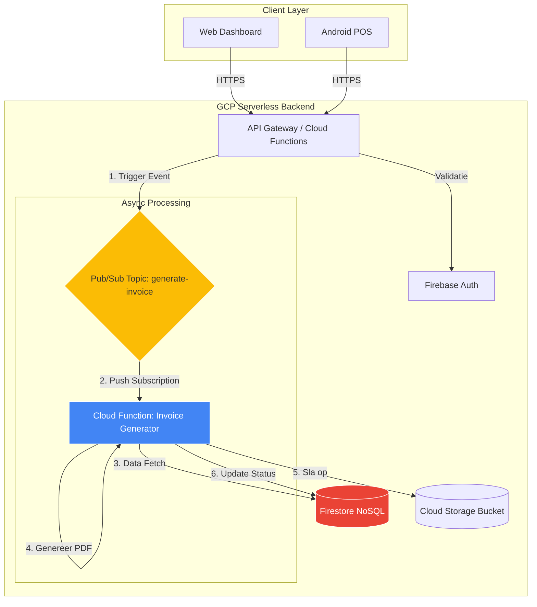

# Sollicitatie Dossier: Sopra Steria

**Functie:** Python Expert / Developer
**Locatie:** Groningen, Nederland
**Status:** In voorbereiding

---

## Overzicht

Dit repository bevat mijn volledige sollicitatiedossier voor de functie van Python Developer bij Sopra Steria in Groningen. Ik ben een **AI-geaugmenteerde Full Stack Cloud Architect** met een sterke ondernemersachtergrond en een passie voor het bouwen van schaalbare cloud-native oplossingen.

### Waarom ik de juiste match ben

- **Lokaal in Groningen** - Direct beschikbaar, geen verhuizing nodig.
- **Native Nederlands** - Vloeiend in de taal van de werkvloer en de klant.
- **Cloud-Native Expertise** - Diepgaande ervaring met Python 3.11, GCP en event-driven architecturen.
- **AI-Driven Workflow** - Realisatie van 3-5x hogere productiviteit door strategische inzet van AI (Gemini/Claude).
- **Ondernemerschap** - Ervaring als solo-founder van multi-tenant SaaS platforms (Cislink).
- **Full-Stack vaardigheden** - Van cloud-infra en Python backends tot Android (Kotlin).

---

## Snelle Links

| Document | Beschrijving |
|----------|-------------|
| **[sollicitatiebrief.md](sollicitatiebrief.md)** | Mijn motivatiebrief op maat voor Sopra Steria |
| **[cv-structure.md](cv-structure.md)** | CV met de focus op architectuur en resultaten |
| **[PORTFOLIO_DEEP_DIVE.md](PORTFOLIO_DEEP_DIVE.md)** | **[NIEUW]** Technische diepgang in mijn grootste projecten |
| **[interview-prep/](interview-prep/)** | Strategie en voorbereiding op het gesprek |

---

## Kenmerkende Projecten

### 1. Cislink Cloud Facturatiesysteem
Een end-to-end facturatieplatform gebouwd op Python 3.11 en GCP Cloud Functions.
- **Tech Stack:** Python, GCP Functions (Gen 2), Pub/Sub, Firestore.
- **Impact:** Verwerkt €50K+ aan maandelijkse facturen; reductie van verwerkingstijd van 2 uur naar 10 seconden.

### 2. AI Voice Operator
Real-time conversationele AI-agent voor de horeca, gebruikmakend van de Gemini Live API.
- **Tech Stack:** Async Python, Gemini API, WebRTC.
- **Impact:** Proof-of-concept voor volledige automatisering van telefonische bestellingen.

### 3. Bonserver-Go (Dual-Engine)
Een keuken-printserver die schaalbaarheid garandeert door een hybride Python/Go architectuur.
- **Tech Stack:** Go (Golang), Python, ESC/POS hardware integratie.
- **Impact:** 100% betrouwbaarheid tijdens piekuren in drukke restaurants.

---

## Architectuur Preview: Cislink Systeem

Dit diagram toont de **Event-Driven Architectuur** die ik heb ontworpen voor schaalbaarheid en foutbestendigheid.

---

## Innovatie: AI-Geaugmenteerde Automatisering

Voor deze sollicitatie heb ik een interactief element toegevoegd. Ik heb een **Serverless Architecture** opgezet die mijn dossier on-the-fly genereert en verzendt.

### 🚀 Live Interactieve Demo
Wilt u de kracht van mijn Python & Cloud automatisering direct in actie zien?

1.  **Klik op de bovenstaande knop** om de generator te openen.
2.  Voer uw zakelijke e-mailadres in of klik op **"Bekijk PDF"**.
3.  Mijn **GCP Cloud Function** genereert on-the-fly een professionele PDF.

> **Technische Stack van deze demo:**
> *   **Hosting:** GitHub Pages (Frontend)
> *   **Backend:** Python 3.11 op Google Cloud Functions (Gen 2)
> *   **Auth:** Gmail API met OAuth2 beveiliging
> *   **PDF Engine:** Custom Python script (`fpdf2`)

---

## Contact

**Naam:** Junyi Zhu
**Locatie:** Groningen, Nederland
**E-mail:** admin@cislink.nl
**Telefoon:** +31 6 8888 8188
**GitHub:** [github.com/CislinkNL](https://github.com/CislinkNL)