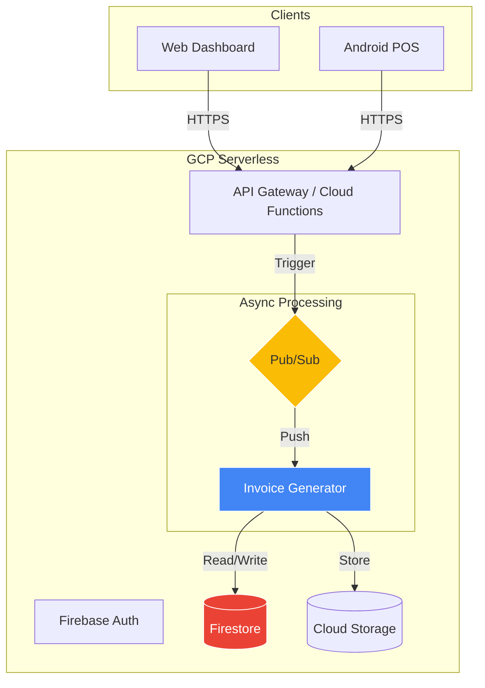

# Hi there, I'm Junyi Zhu 👋

## AI-Augmented Cloud Architect | Python Specialist | SaaS Founder

📍 **Groningen, The Netherlands** | 🤝 **Open to Hybrid/On-site** | 📧 admin@cislink.nl

---

## 🎯 The Hybrid Architect

> **I bridge the gap between Enterprise Stability and AI Innovation.**

Leveraging advanced AI workflows (Gemini/Claude) to deliver production-grade systems with **3x efficiency**.

I build scalable cloud-native solutions that combine:
- **Enterprise-grade reliability** — Event-driven architectures, zero-downtime deployments
- **AI-first development** — LLM-powered agents, real-time voice AI, intelligent automation
- **Full-stack delivery** — From bare metal (IoT/Android) to serverless backends

---

## 🏆 Featured Projects

| Project | Stack | Impact |
|:--------|:------|:-------|
| **🧾 [Cislink Cloud Invoice Engine](https://github.com/CislinkNL)** |    | **Event-driven architecture** automating billing for 1000+ clients. Zero-maintenance serverless design. Processes €50K+ monthly invoices; reduced processing time from 2 hours → 10 seconds. |
| **🤖 [Real-time AI Voice Operator](https://github.com/CislinkNL/voice-ai-python)** |    | **Autonomous voice agent** handling restaurant reservations via phone. Replaces traditional IVR with GenAI. Deployed on Google Cloud Run; sends WhatsApp confirmations. |
| **📱 Multi-Tenant POS Ecosystem** |    | **End-to-end restaurant platform**: Android POS + Cloud backend + Kitchen printers. Dual-engine (Go+Python) print server for 100% uptime. |

---

## 🛠️ Technical Arsenal

### Cloud & Backend
- **Languages:** Python (3.11+), Go (Golang), Kotlin, TypeScript
- **Cloud Platforms:** Google Cloud Platform (Cloud Run, Cloud Functions, Pub/Sub, Firestore)
- **Architecture:** Event-driven, Serverless, Microservices
- **Databases:** Firestore (NoSQL), PostgreSQL, Firebase Realtime Database

### AI & LLMs
- **Models:** Gemini 2.5 (Live API), Claude, GPT-4
- **Applications:** Real-time voice AI, Function Calling, RAG systems, Multi-agent workflows
- **Integration:** WebRTC, WebSocket, Twilio Media Streams

### DevOps & Infrastructure
- **Containerization:** Docker, Cloud Run
- **CI/CD:** GitHub Actions, Cloud Build
- **Monitoring:** Cloud Logging, Cloud Monitoring
- **Hardware:** ESC/POS thermal printers, Android devices

---

## 🚀 Live Demo: AI-Augmented Automation

Experience my Python & Cloud automation in action:

**What happens behind the scenes:**
1. Frontend (GitHub Pages) captures your request
2. GCP Cloud Function (Python 3.11) generates a professional PDF on-the-fly
3. Gmail API (OAuth2) delivers it securely

**Tech Stack:** Python 3.11 · GCP Cloud Functions (Gen 2) · fpdf2 · GitHub Pages

---

## 📈 Architectural Preview

Event-driven architecture I designed for scalability and fault tolerance:

---

## 💼 Why I'm the Right Match

- **📍 Local to Groningen** — Immediately available, no relocation needed
- **🗣️ Native Dutch** — Fluent in the language of the workplace and clients
- **☁️ Cloud-Native Expertise** — Deep experience with Python 3.11+, GCP, event-driven architectures
- **🤖 AI-Driven Workflow** — 3-5x productivity boost through strategic AI (Gemini/Claude) integration
- **🚀 Entrepreneurial DNA** — Solo-founder of multi-tenant SaaS platforms (Cislink)
- **🔧 Full-Stack Delivery** — From cloud infra & Python backends to Android (Kotlin)

---

## 📬 Get In Touch

- **📧 Email:** [admin@cislink.nl](mailto:admin@cislink.nl)
- **📱 Phone:** [+31 6 8888 8188](tel:+31688888188)
- **🔗 GitHub:** [github.com/CislinkNL](https://github.com/CislinkNL)
- **🌐 Website:** [cislink.nl](https://cislink.nl)

---

*Built with ⚡ by an AI-augmented developer in Groningen, Netherlands*
